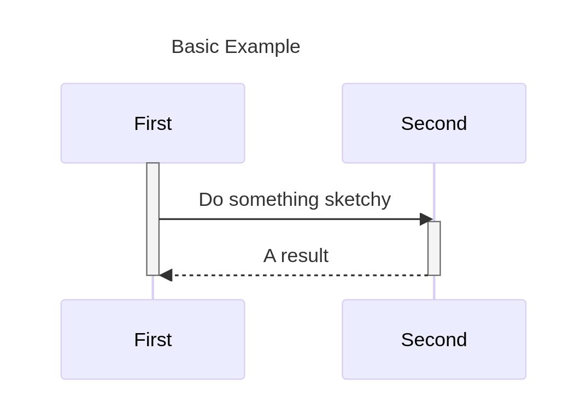
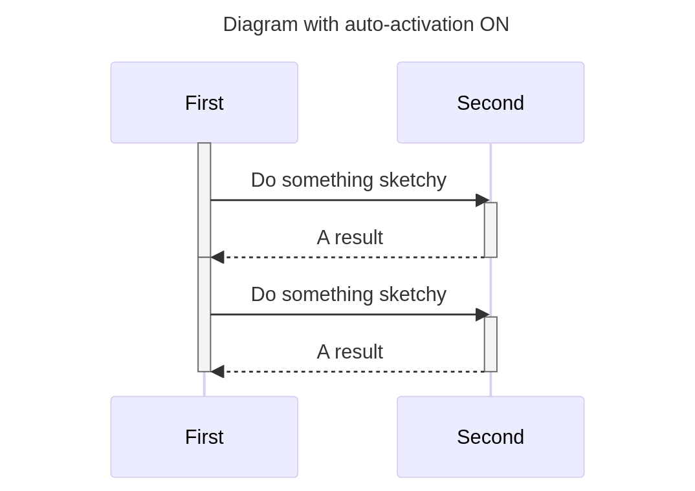
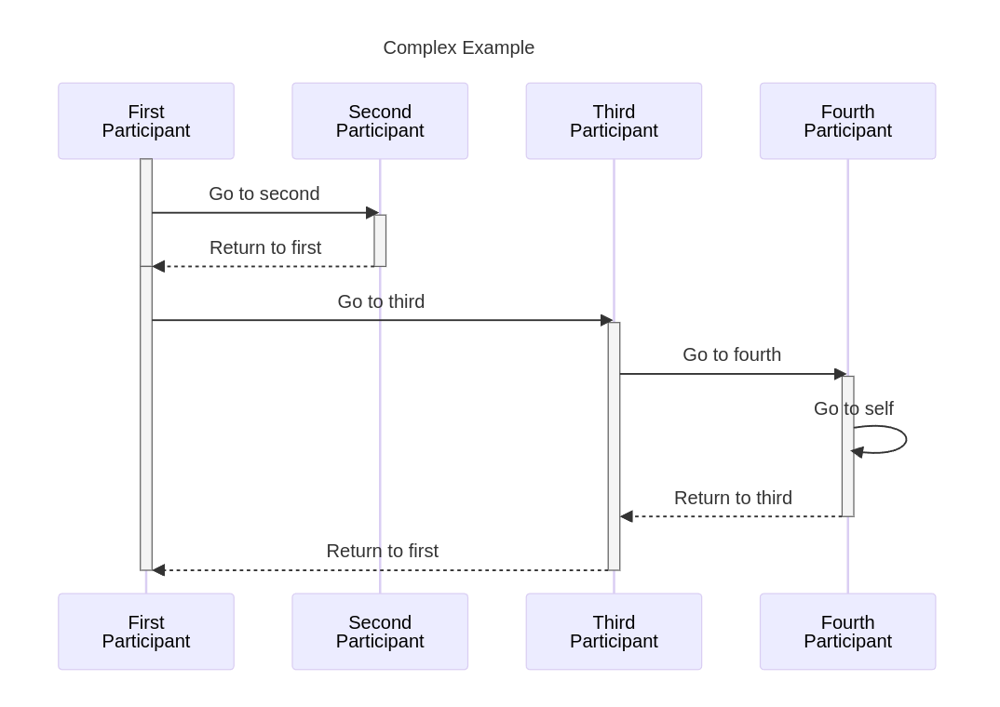
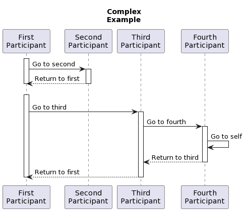
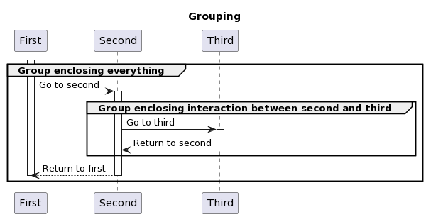
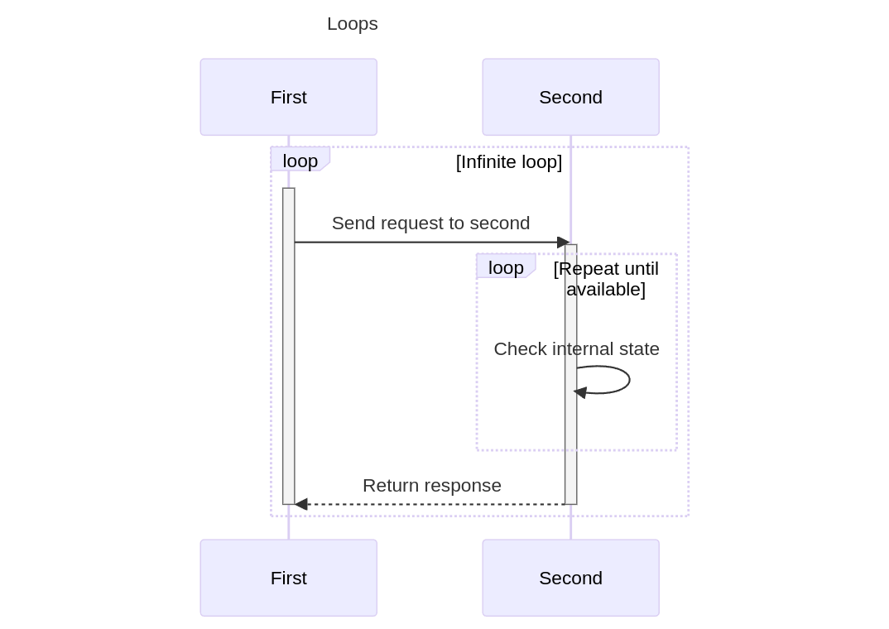
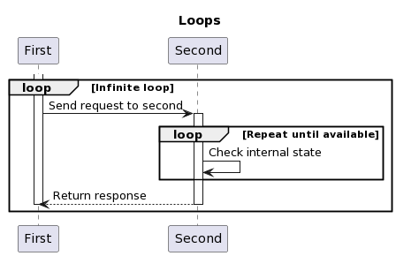
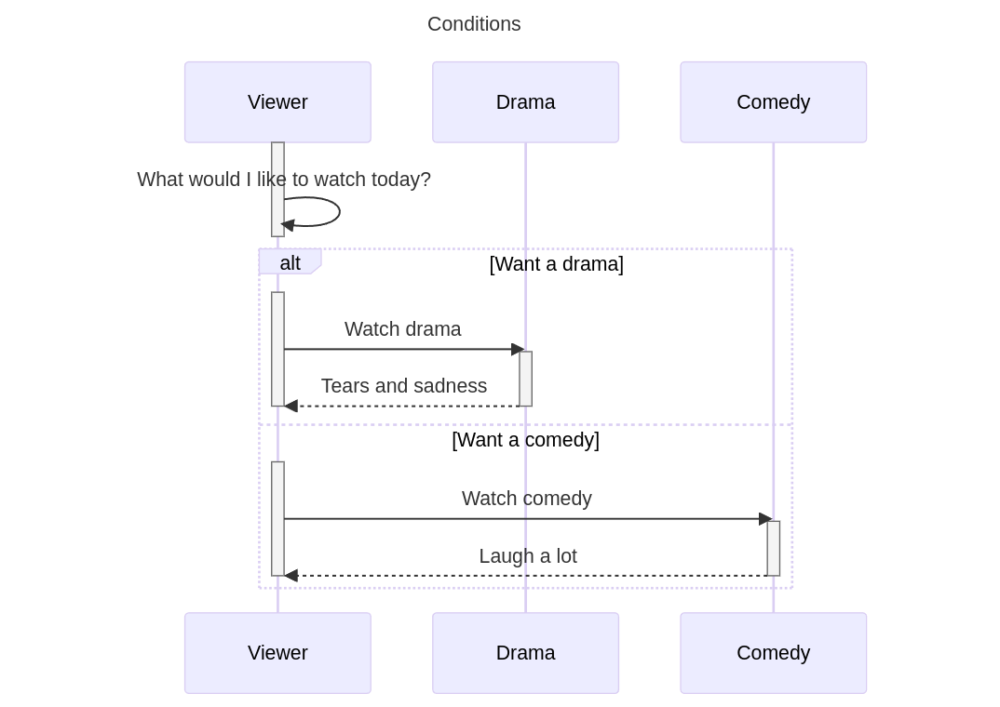
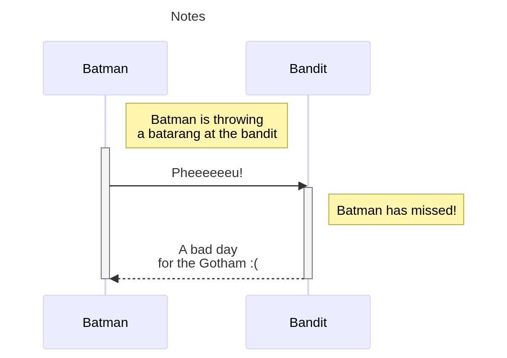
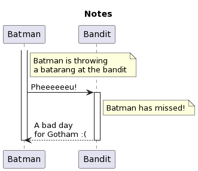

# Sequence Diagrams

### Supported DSLs

| Mermaid | PlantUML | D2 | SequenceDiagram.org | ZenUML |
|---------|----------|----|---------------------|--------|
| ✅       | ✅        | 🚧 | 🚧                  | 🚧     |

For more details about the supported DSLs, please refer to the next links:
- [Mermaid](https://mermaid.js.org/)
- [PlantUML](https://plantuml.com/)
- [D2](https://d2lang.com/tour/sequence-diagrams/)
- [SequenceDiagram.org](https://sequencediagram.org/instructions.html)
- [ZenUML](https://zenuml.com/)


### Quick Start
Every sequence diagram describes some behavioral scenario of interaction (message passing)
between some prototypical actors.

The simplest example to generate a very basic sequence diagram:
```python
from umlcharter import SequenceDiagram, Mermaid

# define the instance of the diagram class, name the diagram and define the DSL being used
sd = SequenceDiagram("Basic Example", Mermaid)

# define the participants
first = sd.participant("First")
second = sd.participant("Second")

# write the flow
first.go_to(second, "Do something sketchy")
second.return_to(first, "A result")

# generate the diagram as a code in a chosen DSL
print(sd)
```
The python code from above will print out the following code in [Mermaid](https://mermaid.js.org/) DSL:
```text
sequenceDiagram
Title: Basic Example
participant p1 as First
participant p2 as Second
activate p1
p1->>p2: Do something sketchy
activate p2
p2-->>p1: A result
deactivate p2
deactivate p1
```
which in turn can be rendered to this image:


Simple, is not it? Now let's take a deeper look.

So, to draw our beautiful diagram, we had to first
- choose the title
- choose the DSL
- and name the participants

In the example from above
```python
from umlcharter import SequenceDiagram, Mermaid

# define the instance of the diagram class, name the diagram and define the DSL being used
sd = SequenceDiagram("Basic Example", Mermaid)

# define the participants
first = sd.participant("First")
second = sd.participant("Second")
```
We have chosen the `"Basic Example"` to be our title, chosen mermaid as a DSL to generate the diagram as a code and
defined two participants of the scenario  titled `"First"` and `"Second"`.

Then we have defined the flow of interaction between the participants using 2 methods:
- `go_to`
- `return_to`
These two methods defines the direction of the activity.

In our example
```python
first.go_to(second, "Do something sketchy")
second.return_to(first, "A result")
```
method `go_to` is used to indicate that the participant `"First"` interacts somehow with `"Second"`,
and the flow now is under control of the participant `"Second"`
In turn, the `return_to` used to return the control back to the first participant.

### Auto-activation

In the sequence diagram, it is quite a common thing to have the concept of the "active"
participant - participant that is holding the current control of the scenario.
By default, every instance of the `SequenceDiagram` is instantiated with the flag `auto_activation=True`.

And it is possible to control this behavior by explicitly switching it off:

```python
from umlcharter import SequenceDiagram, Mermaid

# auto-activation ON
sd_auto_activation_on_1 = SequenceDiagram("Auto-activation switched on by default", Mermaid)
sd_auto_activation_on_2 = SequenceDiagram("Auto-activation switched on explicitly", Mermaid, auto_activation=True)

# auto-activation OFF
sd_auto_activation_off = SequenceDiagram("Auto-activation switched off explicitly", Mermaid, auto_activation=False)
```
_It is recommended
to keep this feature ON by default
unless you want for some reason a granular control over the activation of the participants._ 

When the auto-activation is ON,
the sequence diagram will track the sequence of actions
you have defined and automatically mark the participant that is expected to be controlling the flow as "active".
In such configuration,
it is expected to always return control back to the participant activated the flow earlier;
so instead of the method `return_to` called from participant,
you can optionally use `return_` called from the diagram instance.
Example:
```python
from umlcharter import SequenceDiagram, Mermaid

# define the instance of the diagram class, name the diagram and define the DSL being used
sd = SequenceDiagram("Diagram with auto-activation ON", Mermaid)

# define the participants
first = sd.participant("First")
second = sd.participant("Second")

# use the `return_to` to explicitly indicate the return of the control to the `first` participant
first.go_to(second, "Do something sketchy")
second.return_to(first, "A result")

# OR use the `return_` to just do the same
first.go_to(second, "Do something sketchy")
sd.return_("A result")

print(sd)
```


_**NB**_: it is not guaranteed that _any_ DSL supported by the `umlcharter` allows a granular tuning and control over the activation.
In the worst scenario any piece of code related to the activation of the participants will be just ignored.

A more complex example involving multiple participants using various DSLs:
```python
from umlcharter import SequenceDiagram, Mermaid, PlantUML

for dsl in (Mermaid, PlantUML):
    sd = SequenceDiagram("Complex\nExample", dsl)
    first = sd.participant("First\nParticipant")
    second = sd.participant("Second\nParticipant")
    third = sd.participant("Third\nParticipant")
    fourth = sd.participant("Fourth\nParticipant")
    
    # first block
    first.go_to(
        second, "Go to second"
    ).return_to(
        first, "Return to first"
    )
    
    # second block
    first.go_to(
        third, "Go to third"
    ).go_to(
        fourth, "Go to fourth"
    ).go_to(
        fourth, "Go to self"
    ).return_to(
        third, "Return to third"
    ).return_to(
        first, "Return to first"
    )
    print(sd)
```
| Mermaid                              | PlantUML                              |
|--------------------------------------|---------------------------------------|
|  |  |

For more specific examples and extended functionality, please refer to the rest of the document:

<details>
<summary><h3>Manual activation control</h3></summary>

It is possible to control the activation of the participant manually using the `activate` context manager:

```python
from umlcharter import SequenceDiagram, Mermaid, PlantUML

for dsl in (Mermaid, PlantUML):
    sd = SequenceDiagram(
        "Manual Activation",
        dsl,
        auto_activation=False,
    )
    first = sd.participant("First")
    second = sd.participant("Second")
    
    with first.activate():
        first.go_to(second, "Go to second")
        with second.activate():
            second.go_to(second, "Go to self")
            second.return_to(first, "Return to first")
    
    print(sd)
```
| Mermaid                                        | PlantUML                                        |
|------------------------------------------------|-------------------------------------------------|
|  |  |

</details>

<details>
<summary><h3>Group actions</h3></summary>
Certain actions in the flow can be grouped to visually amplify the 
logical relations between the actions.

To do that you have to use the context manager `group` called from the diagram instance

```python
from umlcharter import SequenceDiagram, Mermaid, PlantUML

for dsl in (Mermaid, PlantUML):
    sd = SequenceDiagram("Grouping", dsl)
    
    first = sd.participant("First")
    second = sd.participant("Second")
    third = sd.participant("Third")
    
    with sd.group("Group enclosing everything"):
        first.go_to(second, "Go to second")
        with sd.group("Group enclosing interaction between second and third"):
            second.go_to(third, "Go to third").return_to(second, "Return to second")
        sd.return_("Return to first")
    
    print(sd)
```
| Mermaid                               | PlantUML                               |
|---------------------------------------|----------------------------------------|
|  |  |

</details>

<details>
<summary><h3>Actions in loop</h3></summary>
Certain actions in the flow can be grouped to visually note these are happening inside a loop.

To identify the group of actions running in a loop, you can use context manager `loop`:

```python
from umlcharter import SequenceDiagram, Mermaid, PlantUML

for dsl in (Mermaid, PlantUML):
    sd = SequenceDiagram("Loops", dsl)
    
    first = sd.participant("First")
    second = sd.participant("Second")
    
    with sd.loop("Infinite loop"):
        first.go_to(second, "Send request to second")
        with sd.loop("Repeat until available"):
            second.go_to(second, "Check internal state")
        sd.return_("Return response")
    
    print(sd)
```

| Mermaid                           | PlantUML                           |
|-----------------------------------|------------------------------------|
|  |  |

</details>

<details>
<summary><h3>Conditional actions</h3></summary>
Certain actions in the flow can be grouped
to visually identify that these are executed in case of the specific condition being met.

To identify the group of actions running if the condition has been met,
you can use context manager `condition`
to identify the beginning of the block
that runs under the condition and the context manager `case` to specifically name the condition:

##### Mermaid
```python
from umlcharter import SequenceDiagram, Mermaid, PlantUML

for dsl in (Mermaid, PlantUML):
    sd = SequenceDiagram("Conditions", dsl, auto_activation=False)
    
    viewer = sd.participant("Viewer")
    drama = sd.participant("Drama")
    comedy = sd.participant("Comedy")
    
    with viewer.activate():
        viewer.go_to(viewer, "What would I like to watch today?")
    
    with sd.condition():
        with sd.case("Want a drama"):
            with viewer.activate():
                viewer.go_to(drama, "Watch drama")
                with drama.activate():
                    drama.return_to(viewer, "Tears and sadness")
        with sd.case("Want a comedy"):
            with viewer.activate():
                viewer.go_to(comedy, "Watch comedy")
                with comedy.activate():
                    comedy.return_to(viewer, "Laugh a lot")
    
    print(sd)
```
| Mermaid                                 | PlantUML                                |
|-----------------------------------------|-----------------------------------------|
|   |  |


</details>

<details>
<summary><h3>Custom notes</h3></summary>
It is possible to add the plates with the custom notes to the diagram.

To place the plate with the text, you can use the method `note`.
These custom notes will be added to the last activated participant in the flow.
If there is no active participant right now, the first participant will be used. 

##### Mermaid
```python
from umlcharter import SequenceDiagram, Mermaid, PlantUML

for dsl in (Mermaid, PlantUML):
    sd = SequenceDiagram("Notes", dsl)
    
    batman = sd.participant("Batman")
    bandit = sd.participant("Bandit")
    
    sd.note("Batman is throwing\na batarang at the bandit")
    batman.go_to(bandit, "Pheeeeeeu!")
    sd.note("Batman has missed!")
    sd.return_("A bad day\nfor Gotham :(")
    
    print(sd)
```
| Mermaid                            | PlantUML                            |
|------------------------------------|-------------------------------------|
|  |  |

</details>